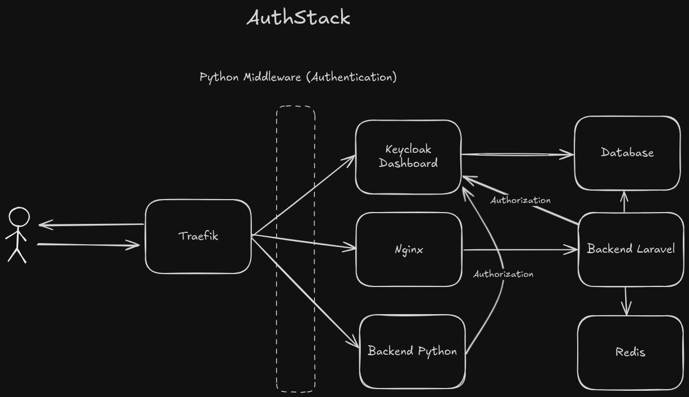

# AuthStack

A secure and scaleble authentication-authorization platform built using modern open-source technologies.

## Stack

- [**Traefik**](./.docker/traefik/readme.md) – Reverse proxy and routing manager
- [**Keycloak**](./.docker/keycloak/readme.md) – Identity and access management
- [**Nginx**](./.docker/webserver/readme.md) – Web server for Laravel
- [**PostgreSQL**](./.docker/postgresql/readme.md) – Relational database
- **Redis** – Caching
- [**FastAPI**](./.docker/python_middleware/readme.md) – Python authentication middleware
- [**Laravel**](./.docker/task_api/readme.md) – Backend API for business logic
- **Swagger** – Documentation

## Archeticture



## Prerequisites

- **Docker** & **Docker Compose**  
- **Make** (for simplified docker commands)  
- **Postman** *(optional, for testing APIs)*  

> Recommended: Docker version >= 28.0, Compose version >= 2.39

## Folder Structure

| Path | Description |
|------|--------------|
| `.docker/keycloak` | Keycloak realm and client configuration |
| `.docker/postgresql` | Default PostgreSQL database setup |
| `.docker/python_middleware` | Python authentication microservice |
| `.docker/redis` | Redis caching |
| `.docker/swagger` | API documentation service |
| `.docker/task_api` | Laravel API for task management (sample CRUD) |
| `.docker/traefik` | Reverse proxy and routing manager |
| `.docker/webserver` | Nginx web server for Laravel application |
| `docs/` | AuthStack documentation |

## Setup

```bash
# linux command
echo "127.0.0.1 keycloak.myproject.com back1.myproject.com traefik.myproject.com task.myproject.com" | sudo tee -a /etc/hosts 
git clone https://github.com/yourusername/authstack.git
cd authstack
cp .env.example .env
make up
```

## Contributers

- [Arxi](https://github.com/arxi-xyz)
